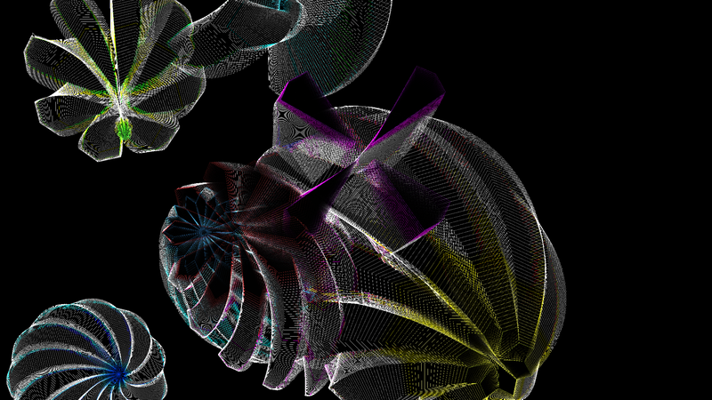
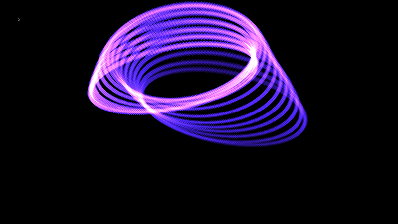
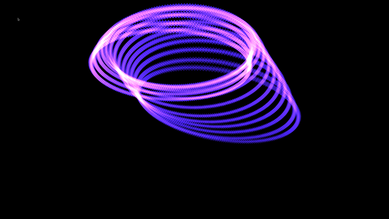
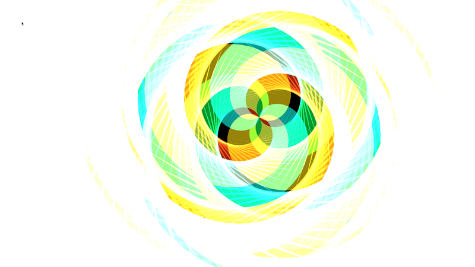
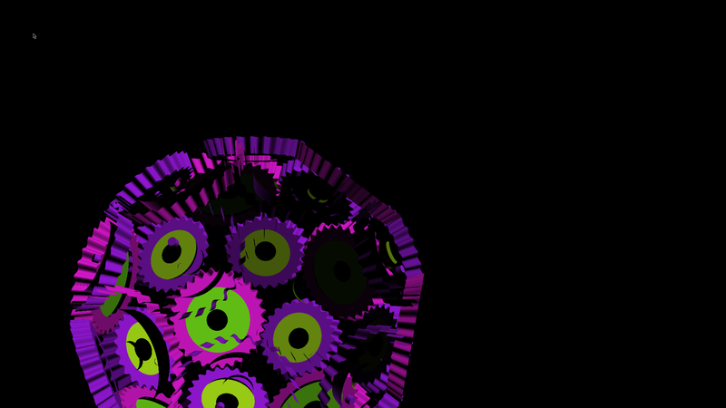

# ncz-screensavers

A native Wayland/EGL/GLES3 screensaver engine, distro-independent, no X11
or Xwayland anywhere in the stack.

## What problem this solves

xscreensaver — the dominant free-software screensaver framework since 1992,
built by Jamie Zawinski ("jwz") — never gained Wayland support, and jwz has
stated publicly he does not intend to add it; xscreensaver's hacks are
written against Xlib/GLX and assume an X11 windowing model throughout.
Meanwhile most Linux distributions have moved, or are moving, to Wayland
compositors with no Xwayland dependency at all. That leaves decades of
real, well-loved visual-effect code with no home on a Wayland-only desktop.

This project's answer: keep the actual rendering ALGORITHMS — the GL
drawing code inside each hack — and rebuild everything AROUND them
natively for Wayland. No Xlib, no GLX, no Xwayland. A small compatibility
layer (`src/xscreensaver_compat.h`/`.c`, `src/gles3_compat.h`/`.c`)
translates xscreensaver's legacy fixed-function OpenGL 1.x calls onto
GLES3's programmable pipeline, and a real Wayland/EGL harness
(`src/gles3_harness.c`) owns the window/surface/frame-loop side. The result
is 90 of the original hacks running as real, GPU-accelerated, standalone
Wayland clients, usable by any compositor (see *Status* below).

## What this is descended from — full credit

- **[xscreensaver](https://www.jwz.org/xscreensaver/)**, by **Jamie
  Zawinski**, since 1992 — the original source of every ported visual
  effect in `src/`. This project owes its entire content to his and
  decades of contributors' work; see the Attribution section below for
  the exact terms under which that code is used here, and per-file
  provenance in `PORTING.md`.
- **[hyprsaver](https://github.com/)** (vendored at `vendor/hyprsaver/`),
  by **Mara Vexa**, MIT licensed — a modern Wayland-native (Hyprland)
  shader-based screensaver project. Its 33 GLSL fragment shaders are being
  ported into this engine as native GLES3 hacks alongside the xscreensaver
  set; see `vendor/hyprsaver/LICENSE` and `vendor/hyprsaver/README.md` for
  its own attribution and terms.

This project itself is an independent, unofficial reimplementation of the
*windowing and dispatch layer* these hacks run under. It does not use,
wrap, or depend on xscreensaver, Xlib, Xwayland, or hyprsaver's own Rust
binary — only their real, credited visual-effect source.


## Screenshots

Real captures from the 2026-09-22 cross-platform validation run (Sky1/Mali
Panthor), not renders or mockups:

| | |
|---|---|
|  `noof` |  `raverhoop` |
|  `etruscanvenus` |  `hypnowheel` |
|  `geodesicgears` | |


## Status (2026-09-22) — what's real today vs. planned

**Real, working, usable by any Wayland compositor RIGHT NOW**: 90 of 94
ported effects build as standalone `<name>_gles3` binaries, linked directly
against system `libGLESv2`/`libEGL` — no gl4es, no translation shim, no
Singularity dependency. Each is a plain Wayland client using only the
protocols listed above (`wlr-layer-shell`, `xdg-shell` fallback). Any
compositor and any idle-management daemon can launch one directly — see
*Using this today* below. The GL4ES runtime-dependency note further down
this file applies ONLY to the 4 remaining legacy `_demo` binaries (kept
temporarily for hacks not yet ported to GLES3-native — see `PORTED.md`); it
does NOT apply to the 90 `_gles3` binaries, which are the ones anyone
integrating today should use.

**Planned, not yet implemented**: the embeddable-library API described in
`include/wlscreensaver.h` (`wlss_create`/`wlss_resize`/`wlss_frame`/
`wlss_destroy`) — a host (a lock screen, a session-lock-aware daemon) hands
the engine an already-owned Wayland surface instead of the engine owning its
own connection. This is the integration path needed for the lock-protected
mode described above (`ext-session-lock-v1` permits exactly one client, so a
separate screensaver process can't attach beneath a lock prompt — the
renderer has to live inside whatever process owns the lock). The header is a
real, reviewed design; the `.c` implementation is the next real deliverable,
tracked at [singularityos-lab/singularity-desktop#263](https://github.com/singularityos-lab/singularity-desktop/issues/263).

### Using this today, on any Wayland compositor (no new code needed)

Every `_gles3` binary is launchable directly by any idle-management daemon
that can run an arbitrary command on idle — `swayidle`, `hypridle`, or
equivalent. Example with `swayidle`:

```
swayidle -w \
    timeout 300 '/path/to/glmatrix_gles3' \
    resume 'pkill -x glmatrix_gles3'
```

This gets you a real, GPU-accelerated, distro-independent screensaver on
ANY wlroots-based compositor today, in unlocked/dismissible mode (the
standard `wlr-layer-shell` overlay surface, not lock-protected). Lock
integration is the wlscreensaver.h work described above, still in progress.


## Attribution

The visual-effect algorithms this project ports (e.g. `src/glmatrix.c`) are
the work of **Jamie Zawinski (jwz)**, author and maintainer of
[xscreensaver](https://www.jwz.org/xscreensaver/) since 1992 — one of the
longest-running, most widely-ported free software projects in existence.
Every vendored hack keeps jwz's original copyright header and permission
notice unmodified (xscreensaver hacks are released under a permissive
MIT-style X Consortium notice, not the GPL); see `PORTING.md` §4 for the
exact, minimal set of edits made to port each file and the file-level headers
in `src/` for per-file provenance.

This project is an independent, unofficial Wayland-native reimplementation of
the *windowing and dispatch layer* xscreensaver hacks run under — it does not
use, wrap, or depend on xscreensaver, Xlib, or Xwayland, and it is not
affiliated with or endorsed by jwz. jwz has publicly and consistently stated
he will not support Wayland in xscreensaver itself; that position is his to
hold, and is unrelated to the credit owed him for the hacks' original
authorship, which this project maintains in full.

DESKTOP-ENVIRONMENT NEUTRAL BY DESIGN: depends only on standard wlroots
protocols (wlr-layer-shell-unstable-v1, ext-session-lock-v1, ext-idle-notify-v1,
xdg-shell) -- nothing Singularity-specific, nothing labwc-specific. Runs on any
compositor implementing those protocols (labwc, sway, hyprland, wayfire, etc.).
Developed and hardware-verified on labwc 0.9.5 / wlroots 0.20.2, Mali-G720
(CIX Sky1), Debian forky arm64 -- that is the test target, not a dependency.
Ships as a singularity deb for NCZ-OS; the binary itself has no Singularity
dependency and is intended for upstream PR to any interested compositor/DE
project, not exclusively singularity/mirko.

protocols/  wlr-layer-shell-unstable-v1.xml, ext-idle-notify-v1.xml,
            ext-session-lock-v1.xml, xdg-shell.xml, wayland.xml
src/        the framework + effects

## Design decision (2026-08-17, agreed with Mirko Brombin / singularityos-lab)

The screensaver renders on ONE OF TWO surface types, selected at runtime by
user config (screensaver lock-protection setting):

1. **Lock-protected**: `ext-session-lock-v1` surface — the SAME surface class
   the native Singularity lockscreen (`ncz-lock`) uses. Compositor-enforced,
   input cannot pass through to the desktop underneath.
2. **Unlocked**: standard `wlr-layer-shell` overlay surface (the current
   round-1..4 implementation path) — dismissible by any keypress.

We are NOT wrapping or porting xscreensaver / Xwayland / the xscreensaver
daemon. This is a native Wayland/EGL/GLES rendering engine; only the
visual-effect *mechanism* (the GL shader approach) is inspired by xscreensaver's
hacks, not its codebase or X11 windowing.

The effect core (shader compile, draw loop, EGL context/surface) must stay
surface-agnostic so it can attach to either a `zwlr_layer_surface_v1` or an
`ext_session_lock_surface_v1` — only the surface-acquisition code branches on
the lock-enabled setting. `ext-session-lock-v1` protocol already in `protocols/`.

## The lockscreen IS the screensaver (2026-08-17, hardware-confirmed)

The dual-surface design above is not a preference. On Wayland it is the only
arrangement that can work, and that was confirmed the hard way on O6N.

**`ext-session-lock-v1` is exclusive by protocol.** While a session is locked
the compositor presents the lock surface and nothing else. A `wlr-layer-shell`
screensaver is therefore INVISIBLE while locked no matter which layer it
requests — `OVERLAY` included. Measured repeatedly on O6N 2026-08-17: every
screenshot taken during a lock showed the lockscreen (clock + password card)
while `glmatrix_demo` was demonstrably alive, rendering frames and holding a
live Mali GPU context underneath it. "Run the screensaver, let the locker cover
it" is not a bug to fix; it is the protocol working as designed.

So a screensaver that must survive locking has to BE the lock surface. There
is no composition path where a separate screensaver process draws beneath a
separate locker process.

### Settled design (agreed with Mirko Brombin, 2026-08-18)

The lock surface will be a NEW GL lock engine, separate from `loginui`. Not a
GL layer bolted into the existing locker.

That closes the question this section used to leave open, and it closes it the
other way from the original plan. The earlier idea — "replace only the static
wallpaper layer of `singularity-lockscreen`" — is not minimal and is now
withdrawn. Reading the locker settles it:

- The wallpaper is not a layer the locker owns. It is a `cairo_surface_t`
  loaded by `loginui_load_wallpaper()` and passed INTO `loginui_render()` as
  `st.background` (`lock_main.c:104`, `:274`, `:283`).
- The whole lock surface is `wl_shm` + Cairo, drawn on the CPU
  (`loginui_create_buffer(shm, ...)` at `:258`, then `wl_surface_attach()` at
  `:290`). **There is no EGL context anywhere in the locker.**

So "add GL to the wallpaper" means giving `loginui` an EGL rendering path, and
`loginui` is a shared library (`dependency('singularity-loginui')`) used by the
greeter and other Sinty components. Mirko flagged exactly this, and is
additionally porting `loginui` to Zig — so building a GL dependency into it now
would be building onto something mid-rewrite.

### Wayland-agnostic, not Singularity-specific

The engine is meant to run on any Wayland compositor, not just Singularity, so
that any distribution can use it as a lock/screensaver engine. That is already
how the code is written — it binds only `wlr-layer-shell`, `ext-session-lock`,
`ext-idle-notify` and `xdg-shell`, with an xdg-shell fallback for compositors
that have no layer-shell (GNOME/Mutter). Nothing links Singularity.

`ncz-screensavers` is the name and stays the name -- open source doesn't
require a neutral name to be shared or reused by other projects/distros.

### Known issue: the lock surface and the greeter get different geometry

The lock screen does not come up at the same resolution as the greeter, and the
cause is measured rather than suspected. On O6N, the same binary reports:

    greeter compositor      initial draw: 3840x2160
    user session (locked)   initial draw: 2194x1234   configured=1

3840x2160 is the panel's native mode; 2194x1234 is the logical size after the
output's **1.75 fractional scale**. The greeter runs before that scale applies
and is handed native pixels; a surface inside the user session is handed
logical coordinates and is expected to render at `scale x logical` into a
buffer it declares.

A GL engine therefore cannot treat the configure size as pixels. It has to take
the logical size from the shell, multiply by the fractional scale, size the EGL
window in real pixels, and set the buffer scale — otherwise it renders a
1.75x-too-small image that the compositor upscales, which looks exactly like
"the lock screen is at the wrong resolution".

### Non-negotiable: keep the hack out of the authenticator

A ported hack is third-party C running legacy fixed-function GL through a
translation shim. If it segfaults inside the process that owns the lock
surface, the locker dies — and depending on how the compositor treats a
vanishing lock client, that can expose the desktop, or (as measured here) leave
the session locked with no client drawing anything at all.

`ext-session-lock-v1` permits ONE lock client, and Wayland subsurfaces must come
from the same `wl_client`, so a separate renderer PROCESS cannot simply attach
itself beneath the prompt. The GL engine and the prompt therefore have to live
in one client, which puts the crash-isolation burden on that client:

1. Render the hack into its own surface owned by the lock client, with the
   prompt as a subsurface above it.
2. Watchdog the hack so a crash or a hang drops instantly to a static
   background while the prompt stays alive and authentication still works.

A dead renderer must never leave the session unlocked, and must never leave a
blank screen with no way to authenticate.

### Runtime requirement for the legacy _demo binaries ONLY (not _gles3)

GL4ES must be INSTALLED ON THE TARGET (`apt install libgl4es0`). The binaries
carry `RUNPATH=/usr/lib/aarch64-linux-gnu/gl4es/`; when that directory is
absent the loader silently resolves `libGL.so.1` to the CIX libglvnd/GLX stack
instead, where legacy fixed-function calls land with no current GLX context and
become no-ops — no error, no crash, no pixels. Measured on O6N 2026-08-17.
