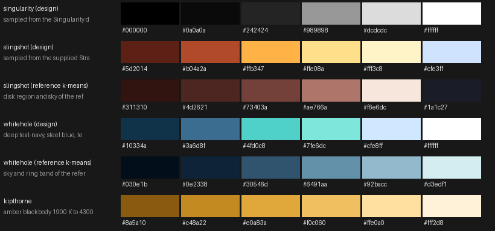

# Black Hole palettes

Six palettes: `stylized`, `kipthorne`, `faithful`, `singularity`, `slingshot`, `whitehole`. Choose one with `--palette=NAME` (see `BLACKHOLE-OPTIONS.md`); `--cycle-palettes` cross-fades between them.

| Palette | Character | Source / design |
|---|---|---|
| stylized | art-directed rainbow bands, hot sector | original look, unchanged default |
| kipthorne | symmetric amber blackbody, no shifts | Interstellar / Gargantua approximation |
| faithful | Doppler and redshift shifted blackbody, blue-white approaching side | Schwarzschild circular orbit, D^3 beaming, exaggerated shift |
| singularity | strictly monochrome white on black | sampled from the Singularity desktop default wallpaper: background #000000, mark #ffffff, greys R=G=B |
| slingshot | brick/rust disk, orange to gold to near-white beamed arc, blue-white limb on the lensed image, navy star-speckled sky | color reference: the supplied Strange New Worlds frame (not shipped) |
| whitehole | icy teal and steel-blue ramp, pale ice core, deep teal-navy sky, hazy blue-gray vortex inside the shadow, cyan/magenta fringe (option `fringe`), wide cool bloom | color reference: the supplied Enterprise-at-the-white-hole frame (not shipped) |

## Distinctness (measured)

Metric: per-pixel chroma distance (chromaticity r,g,b normalized to sum 1) over pixels lit in both renders, same seed (42) and same times; six timestamps per flyby, orbit and slingshot flybys. "mean / min" is over timestamps. Acceptance for singularity vs whitehole: mean >= 0.08, min >= 0.05, singularity lit-pixel chroma < 0.02, whitehole > 0.08: all met on both hosts.

Host CHIMERA (AMD Navi14, Mesa radeonsi):

## flyby=orbit, host=chimera, frames [np.int64(1), np.int64(4), np.int64(8), np.int64(12), np.int64(16), np.int64(20)] of 21
mean chroma of lit pixels (distance from neutral): stylized=0.239, kipthorne=0.223, faithful=0.123, singularity=0.001, slingshot=0.176, whitehole=0.184
pairwise per-pixel chroma distance (mean over timestamps / min over timestamps):
| |stylized|kipthorne|faithful|singularity|slingshot|whitehole|
|---|---|---|---|---|---|---|
|stylized|-|0.275/0.072|0.281/0.189|0.250/0.216|0.280/0.094|0.238/0.090|
|kipthorne|0.275/0.072|-|0.136/0.069|0.234/0.213|0.082/0.057|0.337/0.284|
|faithful|0.281/0.189|0.136/0.069|-|0.119/0.037|0.138/0.079|0.240/0.172|
|singularity|0.250/0.216|0.234/0.213|0.119/0.037|-|0.207/0.194|0.163/0.160|
|slingshot|0.280/0.094|0.082/0.057|0.138/0.079|0.207/0.194|-|0.323/0.306|
|whitehole|0.238/0.090|0.337/0.284|0.240/0.172|0.163/0.160|0.323/0.306|-|

## flyby=slingshot, host=chimera, frames [np.int64(1), np.int64(4), np.int64(7), np.int64(10), np.int64(13), np.int64(16)] of 17
mean chroma of lit pixels (distance from neutral): stylized=0.174, kipthorne=0.160, faithful=0.129, singularity=0.001, slingshot=0.150, whitehole=0.163
pairwise per-pixel chroma distance (mean over timestamps / min over timestamps):
| |stylized|kipthorne|faithful|singularity|slingshot|whitehole|
|---|---|---|---|---|---|---|
|stylized|-|0.194/0.073|0.174/0.086|0.186/0.117|0.222/0.120|0.167/0.085|
|kipthorne|0.194/0.073|-|0.085/0.030|0.166/0.142|0.140/0.056|0.232/0.157|
|faithful|0.174/0.086|0.085/0.030|-|0.128/0.078|0.168/0.069|0.196/0.129|
|singularity|0.186/0.117|0.166/0.142|0.128/0.078|-|0.158/0.131|0.139/0.110|
|slingshot|0.222/0.120|0.140/0.056|0.168/0.069|0.158/0.131|-|0.261/0.174|
|whitehole|0.167/0.085|0.232/0.157|0.196/0.129|0.139/0.110|0.261/0.174|-|

Host MEDUSA (AMD Navi14, Mesa radeonsi):

## flyby=orbit, host=medusa, frames [np.int64(1), np.int64(4), np.int64(8), np.int64(11), np.int64(15), np.int64(19)] of 20
mean chroma of lit pixels (distance from neutral): stylized=0.230, kipthorne=0.224, faithful=0.121, singularity=0.001, slingshot=0.173, whitehole=0.185
pairwise per-pixel chroma distance (mean over timestamps / min over timestamps):
| |stylized|kipthorne|faithful|singularity|slingshot|whitehole|
|---|---|---|---|---|---|---|
|stylized|-|0.264/0.071|0.270/0.189|0.239/0.216|0.275/0.094|0.224/0.091|
|kipthorne|0.264/0.071|-|0.137/0.071|0.234/0.221|0.084/0.056|0.333/0.284|
|faithful|0.270/0.189|0.137/0.071|-|0.116/0.037|0.142/0.084|0.234/0.172|
|singularity|0.239/0.216|0.234/0.221|0.116/0.037|-|0.207/0.199|0.160/0.153|
|slingshot|0.275/0.094|0.084/0.056|0.142/0.084|0.207/0.199|-|0.321/0.312|
|whitehole|0.224/0.091|0.333/0.284|0.234/0.172|0.160/0.153|0.321/0.312|-|

## flyby=slingshot, host=medusa, frames [np.int64(1), np.int64(4), np.int64(8), np.int64(11), np.int64(15), np.int64(19)] of 20
mean chroma of lit pixels (distance from neutral): stylized=0.164, kipthorne=0.156, faithful=0.128, singularity=0.001, slingshot=0.145, whitehole=0.180
pairwise per-pixel chroma distance (mean over timestamps / min over timestamps):
| |stylized|kipthorne|faithful|singularity|slingshot|whitehole|
|---|---|---|---|---|---|---|
|stylized|-|0.155/0.055|0.136/0.048|0.173/0.100|0.216/0.128|0.172/0.080|
|kipthorne|0.155/0.055|-|0.073/0.018|0.159/0.133|0.071/0.045|0.219/0.156|
|faithful|0.136/0.048|0.073/0.018|-|0.119/0.073|0.111/0.069|0.186/0.129|
|singularity|0.173/0.100|0.159/0.133|0.119/0.073|-|0.160/0.131|0.140/0.115|
|slingshot|0.216/0.128|0.071/0.045|0.111/0.069|0.160/0.131|-|0.239/0.174|
|whitehole|0.172/0.080|0.219/0.156|0.186/0.129|0.140/0.115|0.239/0.174|-|

The closest pairs are kipthorne/slingshot (both warm, 0.05 to 0.09 mean) and kipthorne/faithful at far camera distances; every other pair is at least 0.1 on average.

## singularity or whitehole?

Same seed and times, luminance statistics (range = p99 - p1 luminance, bands = occupied bins of a 16-bin luminance histogram, edge = mean gradient x100):

CHIMERA:

orbit (chimera):  palette: dynamic range p1..p99 luminance | luminance bands (16-bin occupied bins >0.5%) | edge detail (mean gradient) | mean chroma
  singularity  range=0.781  bands=11.7  edge=0.64  chroma=0.001
  whitehole    range=0.549  bands=10.0  edge=0.51  chroma=0.185
  slingshot    range=0.686  bands=11.8  edge=0.43  chroma=0.173
  stylized     range=0.712  bands=12.3  edge=0.52  chroma=0.228

slingshot (chimera):  palette: dynamic range p1..p99 luminance | luminance bands (16-bin occupied bins >0.5%) | edge detail (mean gradient) | mean chroma
  singularity  range=0.792  bands=13.0  edge=0.64  chroma=0.001
  whitehole    range=0.607  bands=11.3  edge=0.52  chroma=0.166
  slingshot    range=0.697  bands=10.8  edge=0.37  chroma=0.140
  stylized     range=0.758  bands=12.7  edge=0.54  chroma=0.170

MEDUSA:

orbit (medusa):  palette: dynamic range p1..p99 luminance | luminance bands (16-bin occupied bins >0.5%) | edge detail (mean gradient) | mean chroma
  singularity  range=0.779  bands=11.8  edge=0.63  chroma=0.001
  whitehole    range=0.545  bands=9.8  edge=0.51  chroma=0.185
  slingshot    range=0.681  bands=11.7  edge=0.42  chroma=0.166
  stylized     range=0.708  bands=12.2  edge=0.52  chroma=0.218

slingshot (medusa):  palette: dynamic range p1..p99 luminance | luminance bands (16-bin occupied bins >0.5%) | edge detail (mean gradient) | mean chroma
  singularity  range=0.788  bands=12.2  edge=0.61  chroma=0.001
  whitehole    range=0.597  bands=11.0  edge=0.49  chroma=0.173
  slingshot    range=0.697  bands=10.7  edge=0.38  chroma=0.143
  stylized     range=0.724  bands=12.2  edge=0.50  chroma=0.164

singularity has the widest dynamic range (0.78 vs 0.55) and the crispest edges (0.64 vs 0.51): black sky, white disk, it reads as the Singularity desktop and is the more elegant, graphic look. whitehole has more depth: a graded navy sky, hazy vortex inside the shadow, bloom and the teal to ice ramp give it more luminance layers and a sense of volume, and it is the more spectacular of the two. Recommendation: keep whitehole as the showpiece; keep singularity only if a brand-matching monochrome option is wanted. Deleting singularity later needs a deprecated alias that maps it to whitehole for one release.

Images (same seed, six timestamps per row):

* `blackhole/sheet_chimera_orbit.jpg`, `blackhole/sheet_chimera_slingshot.jpg`: all six palettes (rows: stylized, kipthorne, faithful, singularity, slingshot, whitehole) at six timestamps.
* `blackhole/full_singularity_vs_whitehole_chimera_orbit.jpg` and `..._slingshot.jpg` (also `medusa`): full frames, singularity left, whitehole right.
* `blackhole/detail_chimera_orbit.jpg`, `blackhole/detail_chimera_slingshot.jpg`: full-resolution 640x640 crops of the ring and disk (columns: singularity, whitehole, slingshot, stylized).

PEGASUS (Intel) and O6N renders of the same matrix are added when those hosts are free of other GPU test runs; O6N numbers are only valid on the Mali (mali_kbase) driver.
